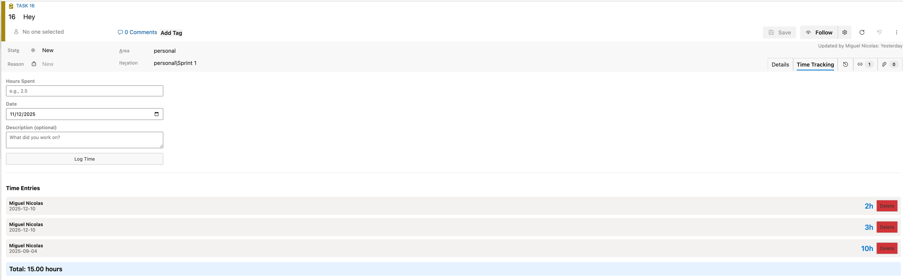
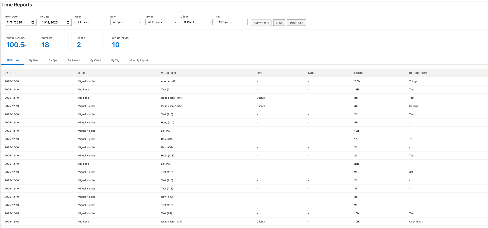

# Azure DevOps Time Tracker Extension

A lightweight time tracking extension for Azure DevOps that runs directly in your browser. Log time against work items and generate reports - no backend server required.

## Screenshots

### Time Entry on Work Items

*Log hours directly from any work item's "Time Tracking" tab*

### Time Reports Hub

*View and filter all time entries with summary statistics and CSV export*

## Features

### Time Entry (Work Item Form)
- Log hours spent on any work item (Tasks, Bugs, User Stories, Features, etc.)
- Add date and optional description (max 100 characters)
- View all time entries for the current work item
- Delete your own entries
- Gentle reminder when closing work items without logged time
- **Smart Property Inheritance**: Automatically inherits missing properties from parent work items

### Property Inheritance

When logging time on a Task or Bug, the extension automatically inherits missing properties from the parent hierarchy:

| Property | Inheritance Chain |
|----------|-------------------|
| Tags | Task/Bug → User Story/Feature → Epic |
| Project | Task/Bug → User Story/Feature → Epic |
| Client | Task/Bug → User Story/Feature → Epic |
| Epic | Automatically resolved from hierarchy |

This means you only need to set Tags, Project, and Client on your User Stories or Epics - all child work items will inherit these values automatically.

### Time Reports (Hub)
- Filter by date range, user, epic, project, client, and tags
- Summary cards showing total hours, entries, users, and work items
- Multiple views:
  - **All Entries**: Detailed list with Date, User, Work Item, Parent (User Story/Feature), Epic, Tags, Hours, and Description
  - **By User**: Hours aggregated per team member
  - **By Epic**: Hours aggregated per epic
  - **By Project**: Hours aggregated per project
  - **By Client**: Hours aggregated per client
  - **By Tag**: Hours aggregated per tag
  - **Monthly Report**: Matrix view showing hours per user per User Story - automatically aggregates tasks/bugs under their parent User Story (great for invoicing)
- **Export Options**:
  - **CSV Export**: Export current view data for external processing/invoicing
  - **Backup JSON**: Full backup of all time entries with metadata

## Installation

### Prerequisites
- Node.js and npm installed
- Azure DevOps organization
- Publisher account on [Visual Studio Marketplace](https://marketplace.visualstudio.com/manage/publishers)

### Steps

1. **Install the TFX CLI**
   ```bash
   npm install -g tfx-cli
   ```

2. **Update the manifest**
   
   Edit `vss-extension.json` and replace `YOUR_PUBLISHER_ID` with your actual publisher ID.

3. **Add an icon**
   
   Place a 128x128 PNG icon at `static/icon.png`

4. **Package the extension**
   ```bash
   tfx extension create --manifest-globs vss-extension.json
   ```

5. **Upload to your organization**
   - Go to your Azure DevOps organization settings
   - Navigate to Extensions > Browse marketplace > Manage extensions
   - Upload the generated `.vsix` file
   - Or publish to the marketplace: `tfx extension publish --manifest-globs vss-extension.json`

## Usage

### Logging Time
1. Open any work item (User Story, Bug, Task, etc.)
2. Click on the "Time Tracking" tab
3. Enter hours, select date, add optional description
4. Click "Log Time"

### Viewing Reports
1. Go to Boards > Time Reports
2. Set your date range and filters
3. Switch between different views (All Entries, By User, By Epic, By Tag)
4. Click "Export CSV" to download the data

## Optional: Custom Fields for Project/Client Tracking

The extension can optionally use custom fields to track **Project** and **Client** for each time entry. This is useful for agencies or teams working on multiple projects/clients.

### Setting Up Custom Fields (Optional)

If you want project/client tracking:

1. Go to **Organization Settings** > **Process**
2. Select your process (e.g., Agile, Scrum)
3. Click on a work item type (e.g., User Story)
4. Add two new fields:
   - **Name**: `Project` | **Type**: Text | **Reference name**: `Custom.Project`
   - **Name**: `Client` | **Type**: Text | **Reference name**: `Custom.Client`

If these fields don't exist, the extension will still work - entries will simply show "(No Project)" and "(No Client)".

## Data Storage

Time entries are stored using Azure DevOps Extension Data Service with **collection-scoped storage**. This means:
- All time entries are visible to all team members
- The Scrum Master (or anyone) can export all team data
- Data persists across sessions
- Data is tied to your Azure DevOps organization/collection
- Data is partitioned by month for performance

## Limitations

- Hierarchy support works for standard Azure DevOps hierarchy (Epic → Feature → User Story → Task/Bug)
- Property inheritance only applies to new time entries (existing entries won't be retroactively updated)
- Users can only delete their own time entries
- Custom.Project and Custom.Client fields must use exact reference names if you want project/client tracking
- Maximum of 3 levels of hierarchy traversal (work item → parent → grandparent)

## Development

To test locally:
```bash
# Install dependencies (if adding any)
npm install

# Create the package
tfx extension create --manifest-globs vss-extension.json

# For development, you can use --rev-version to auto-increment
tfx extension create --manifest-globs vss-extension.json --rev-version
```

## File Structure

```
azdo-timetracker/
├── vss-extension.json    # Extension manifest
├── README.md             # This file
├── src/
│   ├── time-entry.html   # Work item form page
│   └── time-report.html  # Reports hub
└── static/
    └── icon.png          # Extension icon (add your own)
```

## License

MIT License - see [LICENSE](LICENSE) file for details.

This software is provided "as is", without warranty of any kind. Use at your own risk.
